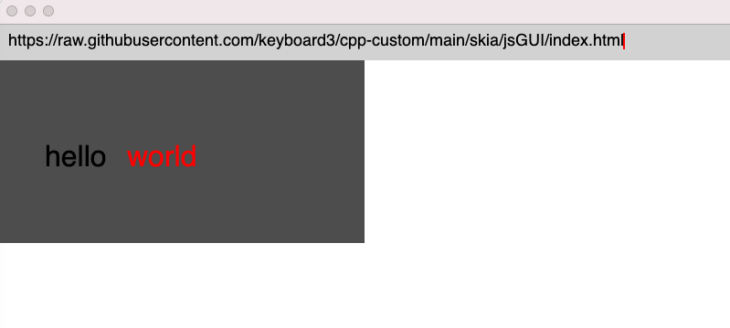

# Skia

## jsGUI
简易浏览器(基于 Skia 和 Quickjs)
### 前言

因为编译产物较大，建议自行编译，见 [Makefile](./Makefile)

简易 Html 解释器实现见[../parser/htmlParser.cpp](https://github.com/keyboard3/cpp-custom/blob/main/parser/htmlParser.cpp)

### 特性

  - 支持简易 html 标记语言解析渲染
  - 支持解析 javascript 标签运行
  - 支持标签绑定 onclick 事件
  - 支持 document.getElementById 读取指定 dom 对象
  - 支持 dom 对象上 width,height,innerHtml 属性以及 setAttribute 重渲染
  - 支持地址栏 file 协议访问本地文件渲染
  - 支持地址栏 http/https 协议访问服务器渲染（同步，基于 curl）

### 代码

```html
<html width="400" height="800">
  <div
    id="first"
    width="200"
    height="200"
    color="black"
    background="yellow"
    fontSize="28"
    onclick="clickChange();"
  >
    click me3
  </div>
  <script>
    function clickChange() {
      ele = window.document.getElementById("first");
      ele.width = 400;
      ele.setAttribute("background", "dkgray");
      ele.innerHtml =
        '<div fontSize="28" y="100" x="50">hello</div><div fontSize="28" x="140" color="red" y="100">world</div>';
    }
  </script>
</html>
```

### 效果


